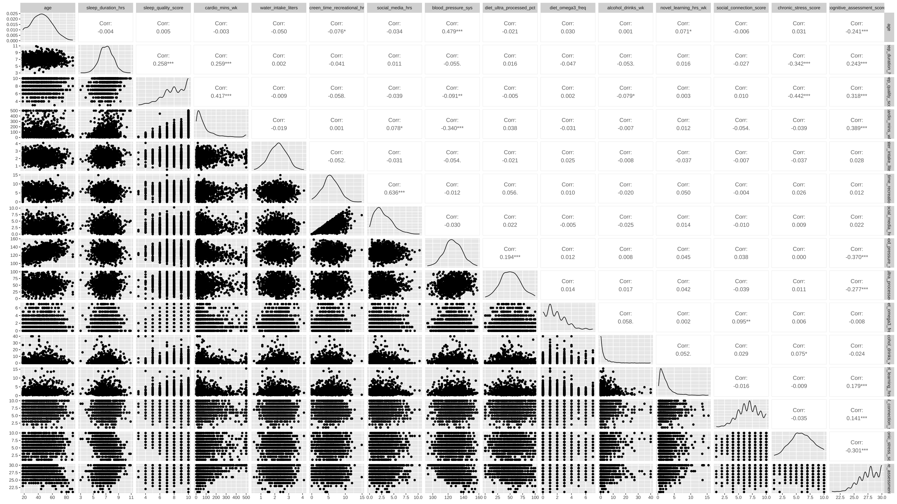
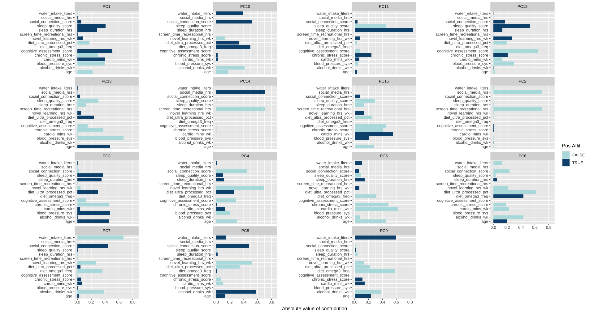

# Predictive models to predict cognitive performance using random forest & linear regression


## Introduction

Cognitive decline is a common feature of aging and is shaped by both modifiable and nonmodifiable factors, including physical fitness, psychological stress, and genetic predisposition. In some individuals, cognitive deterioration may occur at an accelerated rate and progress to mild cognitive impairment, thereby increasing the risk of Alzheimer’s disease and related dementias. Despite advances in the management of cognitive decline, the development of effective interventions to prevent or delay its progression remains challenging because of the complex interplay among the biological, behavioral, environmental, and genetic factors that influence cognitive aging.

### Data Dictionary 
Demographics & Biometrics:

age (Integer): The simulated age of the partici- pant (ranging from 18 to 90).

blood_pressure_sys (Integer): Simulated systolic blood pressure (the top number). This is mathematically influenced by age, diet, stress, and exercise within the simulation.

Core Lifestyle Habits:

sleep_duration_hrs (Float): Average hours of sleep per night. Negatively impacted by high stress levels in the simulation.

sleep_quality_score (Integer): Self-rated scale from 1 (poor) to 10 (excellent).

cardio_mins_wk (Integer): Total minutes of elevated heart rate exercise per week. Follows a log-normal distribution to mimic reality (most do a little, a few do a lot).

water_intake_liters (Float): Average daily water consumption. (Note: Included as a "noise" variable for feature selection practice).

screen_time_recreational_hrs (Float): Daily hours spent on non-work screens.

social_media_hrs (Float): Daily hours specifically on social media apps.

Diet & Substance Intake:

diet_ultra_processed_pct (Float): Estimated percentage of the participant's diet consisting of highly processed foods.

diet_omega3_freq (Integer): Frequency (days per week) of consuming brain-healthy foods like fish, nuts, or seeds.

smoking_status (Categorical): Survey response categorized as "Current", "Former", or "Never".

alcohol_drinks_wk (Integer): Total alcoholic beverages consumed per week.

Neuroplasticity & Mental Health:

novel_learning_hrs_wk (Float): Hours per week spent learning a new, difficult skill (e.g., a new language, coding, instrument). Acts as a neuroprotective bonus in the target calculation.

social_connection_score (Integer): Self-rated scale from 1 (isolated) to 10 (highly supported) on feeling connected to others.

chronic_stress_score (Integer): Self-rated scale from 1 (low) to 10 (high) on daily perceived stress. Acts as a heavy penalty to the target score.

Target Variable (The Output):

cognitive_assessment_score (Integer): The target variable designed for regression models. Modeled after the real-world MoCA (Montreal Cognitive Assessment) scale from 5 to 30. It is the mathematical culmination of a perfect baseline score minus penalties (age, stress, poor diet, smoking) plus bonuses (cardio, learning, social connection), along with randomized, irreducible human noise.

## Aim of the study

This project aims to characterize cognitive performance among adults aged 18 to 59 years by: (1) determining whether individuals with similar behavioral profiles exhibit similar cognitive performance and (2) identifying the behavioral factors that are the strongest predictors of cognitive performance. 

## Methods

This synthetic data set is obtained from Kaggle (see ref. below), with entries of 500,000 and 16 observations which includes lifestyle input, biological & demographic data with realistic distribution. Correlation analysis is used to determine the correlations between observations. Principal component analysis is employed to evaluate if the continuous variables could be summarized using fewer dimensions. Machine-learning models, including random forest and regression-based approaches, will then be developed to determine the relative importance of these behavioral factors and predict cognitive performance.


## Results
### Load the library

```{r}
# Load a library
library(dplyr)
library(tidyverse)
library(rsample)
library(tidymodels)
library(ranger)
library(embed)
library(dlookr)
library(ggplot2)
library(factoextra)
library(cowplot)


# Load data
raw <- read.csv("/Users/olliekong/Documents/GitHub/jengshikong.github.io/projects/clean_realistic_survey_data_500k.csv")
```

First, let's look at how age group affects cognitive assessment scores.

### Cognitive assessment scores between age groups
```{r}
age_data_plot <- raw |> 
  mutate(age_group = factor(case_when(
  age >= 18 & age < 40 ~ "Younger adults",
  age >= 40 & age < 65 ~ "Middle-aged adults",
  age >= 65 & age <=90 ~ "Older adults"),
  levels = c("Younger adults", "Middle-aged adults", "Older adults"),
  ordered = TRUE)
  )

ggplot(age_data_plot, aes(x = age, fill = age_group)) +
  geom_histogram(binwidth = 1) +
  geom_vline(xintercept = 39.5, linetype = "dashed") +
  geom_vline(xintercept = 64.5, linetype = "dashed") +
  labs(subtitle = "Histogram of sample by age", x = "Age")
 
sum(raw$age == 18)

ggplot(age_data_plot, aes(x = age_group, fill = age_group)) +
  geom_bar()+
  theme_cowplot()+
  labs(subtitle = "Distribution of sample by age group", x = "Age group")+
  scale_y_continuous(labels = label_number(big.mark = ","))

ggplot(age_data_plot, aes(x = age_group, y = cognitive_assessment_score, color = age_group)) +
  geom_boxplot()+
  theme_cowplot()+
  labs(subtitle = "Cognitive assessment scores between age groups", x = "Age group", y = "Cognitive assessment score")

```

Good to know that quite a bit of participants are age 18.

From here we can see that younger adults have similar median when compared to middle-aged adult, and older adults have lower median. 

It is not surprising that age has a negative effect on cognitive performance, but what about other variables. The quick view way is to run a correlation matrix. 

### Correlation matrix
```{r}
#Correlation matrix (dropped smoking status data because its categorical)
#too much data
set.seed(756)

mat <- raw |>
  dplyr::select(where(is.numeric))

mat_sample <- mat |> slice_sample(n = 1000)

CMplot <- GGally::ggpairs(mat_sample, method = "pearson")

CMplot
```

Looks bad, right? That's why I have the image here.


From the data we have an idea that most of our variables are relatively normally distributed (except smoking status) and several variables have correlations with cognitive assessment scores, (i.e. age: -0.241, sleep duration: 0.243, sleep quality: 0.318, cardio minutes per week: 0.389, systolic blood pressure: -0.370, ultra processed diet: -0.277, novel learning hrs: 0.179, social connection score: 0.141, chronic stress score: -0.301), but how do we find out which one has the biggest effects? If you guess random forest, that's where we are going into!

But before that, let's run a PCA to summarize the variation and see if this dataset can be represented by a smaller number of components.

### PCA
```{r}
#PCA
set.seed(999)

pca_recipe <- recipe(~., data = raw) |>
  update_role(smoking_status, new_role = "id") |>
  step_naomit(all_predictors()) |>
  step_normalize(all_predictors()) |>
  step_pca(all_predictors(), id = "pca")

pca_recipe

#Prep data
pca_prep <-prep(pca_recipe, raw)

pca_prep

#Bake data
pca_bake <- bake(pca_prep, new_data = NULL)

pca_bake

#Evaluate PCA
pca_prep |>
  tidy(id = "pca", type = "variance") |>
  filter(terms == "percent variance") |>
  ggplot(aes(x = component, y = value)) +
  geom_col(fill = "skyblue") +
  xlim(c(0, 16)) +
  ylab("% of total variance") +
  geom_text(aes(label = round(value, 1)), vjust = 1.5)+
  labs(subtitle = "Percent variance explained by component")

pca_cumulative_table <- pca_prep |>
  tidy(id = "pca", type = "variance") |>
  filter(terms == "cumulative percent variance") |>
  transmute(
    Component = paste0("PC", component),
    Cumulative_Variance = round(value, 1)
  )

pca_cumulative_table

# Plot which predictors/variables are explained in each principal component
pca_prep |>
  tidy(id = "pca", type = "coef") |> 
  ggplot(aes(abs(value), terms, fill = value > 0)) +
  geom_col() +
  facet_wrap(~component, scales = "free_y") +
  scale_fill_manual(values = c("#b6dfe2", "#0A537D")) +
  labs(
    x = "Absolute value of contribution",
    y = NULL, fill = "Pos Affil") 

```



As we can see that first 5 PCs only explain 51.2% of variances, and the first 10 PCs explain 84.5% of total variances. But since we only have 15 variables, the dimensionality reduction with PCA is fairly small.

Now, let's run random forest & linear regression to determine which model can help us better at predicting cognitive performance, as well as which variables hold most importance in influencing cognitive performance.

Let's have a look at how cognitive performance distributes across group.

### Random Forest & Linear Regressions
```{r}
# rf & lr: Prepare the dataset
grouped_data <- raw |> 
  mutate(Performance_i = factor(case_when(
  cognitive_assessment_score >= 16 & cognitive_assessment_score < 22 ~ "Low",
  cognitive_assessment_score >= 22 & cognitive_assessment_score < 26 ~ "Average",
  cognitive_assessment_score >= 26 & cognitive_assessment_score <= 30 ~ "High"),
  levels = c("Low", "Average", "High"), 
  ordered = TRUE), 
  
  Never_smoke = case_when(
  smoking_status == "Never" ~ 1,
  smoking_status != "Never" ~ 0),
  
  Former_smoke = case_when(
  smoking_status == "Former" ~ 1,
  smoking_status != "Former" ~ 0),
    
  Current_smoke = case_when(
  smoking_status == "Current" ~ 1,
  smoking_status != "Current" ~ 0)
  )

age_grouped_data <- grouped_data |> 
  mutate(age_group = factor(case_when(
  age >= 18 & age < 40 ~ "Younger adults",
  age >= 40 & age < 65 ~ "Middle-aged adults",
  age >= 65 & age <=90 ~ "Older adults"),
  levels = c("Younger adults", "Middle-aged adults", "Older adults"),
  ordered = TRUE)
  )

ggplot(age_grouped_data, aes(x = Performance_i, fill = age_group)) +
  geom_bar() +
  theme_cowplot()+
  labs(subtitle = "Cognitive performance distribution by age group", x = "Performance")+
  scale_y_continuous(labels = label_number(big.mark = ","))

ggplot(age_grouped_data, aes(x = Performance_i, fill = smoking_status)) +
  geom_bar() +
  theme_cowplot()+
  scale_color_viridis_d() +
  labs(subtitle = "Cognitive performance distribution by smoking status", x = "Performance")+
  scale_y_continuous(labels = label_number(big.mark = ",")) 
  

data_i <- subset(grouped_data, select = -c(smoking_status, cognitive_assessment_score)) 
```

We have a good number of high cognitive performers in the data set.

Preparing our data set.

```{r}
# set a seed in order to make the analysis reproducible.
set.seed(666)

# split the data into training and testing sets. We will train the model on the training set and then test how well it worked on the testing data.

data_final <- data_i |>
  slice_sample(n= 80000)

# split the data 70% for training and 30% for testing. The bulk of the data is usually used for training the models. 
split_data <- initial_split(data_final, prop=1/2, strata = Performance_i)
data_training <- training(split_data)
data_testing <- testing(split_data)

# lets check it did the split correctly, if a different seed was used a the splits would be slightly different.  

data_training |> 
  group_by(Performance_i) |>
  summarise( count = n(),
             percent = n()/nrow(data_training) * 100)
  
data_testing |> 
  group_by(Performance_i) |>
  summarise( count = n(),
             percent = n()/nrow(data_testing) * 100)

# The recipe sets up what data we are going to use and how it to be treated before doing the modeling.
memory_recipe <-
  recipe( Performance_i ~ age + sleep_duration_hrs + sleep_quality_score + cardio_mins_wk + water_intake_liters + screen_time_recreational_hrs + social_media_hrs + blood_pressure_sys + diet_ultra_processed_pct + diet_omega3_freq + alcohol_drinks_wk + novel_learning_hrs_wk + social_connection_score + chronic_stress_score + Never_smoke + Former_smoke + Current_smoke, data = data_final) |>
  step_naomit(all_predictors()) |> 
  step_normalize(all_predictors()) 

memory_recipe

# The prep step pulls in all the variables from the recipe based on the dataset we give it. 
data_prep <- prep(memory_recipe, data_training)
data_prep


# the bake steps preforms the prep steps and in this case normalizes all the data.
data_bake <- bake(data_prep, new_data = NULL)
data_bake

```

Running random forest. Set mode "classification" for our discrete outcome (cognitive performance), engine "ranger", importance "impurity", 17 predictors, trees are set to 1000.

```{r}
# MODEL 1 Random Forest
rf_model <- 
  
  # specify model
  rand_forest() |>
  
  # mode as classification not continuous
  set_mode("classification") |>
  
  # engine/package that underlies the model (ranger is default)
  set_engine("ranger", importance = "impurity") |>
  
  # 17 predictors
  set_args(mtry = 17, trees = 1000)
  

# Put everything together 
rf_wflow <- 
  workflow() |>
  add_recipe(memory_recipe) |>
  add_model(rf_model)


# train the model
rf_fit <- fit(rf_wflow, data_training)

# Test the importance of the variables
rf_engine <- extract_fit_engine(rf_fit)

rf_importance <- rf_engine$variable.importance

rf_importance

rank(rf_importance)
```

Here we see that age shows the highest importance, followed by diet_ultra_processed_pct, cardio_mins_wk, novel_learning_hrs_wk, and chronic_stress_score. Let's continue with linear regression model.

```{r}

# MODEL 2 Logistic Regression
lr_model <- 
  
  # specify that the model is a multinom_reg
  multinom_reg() |>
  
  # mode as classification not continuous
  set_mode("classification") |>
  
  # select the engine/package that underlies the model (nnet is default)
  set_engine("nnet")
  

# Put everything together 
lr_wflow <- 
  workflow() |>
  add_recipe(memory_recipe) |>
  add_model(lr_model)

# train the model
lr_fit <- fit(lr_wflow, data_training)
```

Now that we finish training our models, let's test them.

```{r}

# predict the species of the testing data we held back for each model
rf.predict <- predict(rf_fit, data_testing)
lr.predict <- predict(lr_fit, data_testing)

# create a table comparing the predicted species from the true species
rf.outcome <- rf.predict %>%
  transmute(pred = .pred_class,
            truth = data_testing$Performance)

# confusion matrix
rf.outcome |> conf_mat(pred, truth)

conf_mat(rf.outcome, truth = truth, estimate = pred) %>%
  autoplot(type = "heatmap") + labs(subtitle = "random forest")

# accuracy
rf.outcome |> accuracy(pred, truth) -> rf.acc

# specificity
rf.outcome |> spec(pred, truth) -> rf.spec

# sensitivity
rf.outcome |> sens(pred, truth) -> rf.sens

# precision
rf.outcome |> precision(pred, truth) -> rf.prec

rf.eval <- c(rf.acc$.estimate, rf.spec$.estimate, rf.sens$.estimate, rf.prec$.estimate)
names(rf.eval) <- c("accuracy", "specificity", "sensitivity", "precision")

# create a table comparing the predicted species from the true species
lr.outcome <- lr.predict %>%
  transmute(pred = .pred_class,
            truth = data_testing$Performance_i)

# confusion matrix
lr.outcome |> conf_mat(pred, truth)

conf_mat(lr.outcome, truth = truth, estimate = pred) %>%
  autoplot(type = "heatmap") + labs(subtitle = "logistic regression")

# accuracy
lr.outcome |> accuracy(pred, truth) -> lr.acc

# specificity
lr.outcome |> spec(pred, truth) -> lr.spec

# sensitivity
lr.outcome |> sens(pred, truth) -> lr.sens

# precision
lr.outcome |> precision(pred, truth) -> lr.prec

lr.eval = c(lr.acc$.estimate, lr.spec$.estimate, lr.sens$.estimate, lr.prec$.estimate)
names(lr.eval) <- c("accuracy", "specificity", "sensitivity", "precision")

rbind(rf.eval, lr.eval)

```

 

What if we group age together.

### Age grouped rf & lr

```{r}
# rf & lr: Prepare the dataset
cleaned_data <- age_grouped_data |>
    mutate(Younger_adults = case_when(
    age_group == "Younger adults" ~ 1,
    age_group != "Younger adults" ~ 0),
  
    Middle_aged_adults = case_when(
    age_group == "Middle_aged adults" ~ 1,
    age_group != "Middle_aged adults" ~ 0),
    
    Older_adults = case_when(
    age_group == "Older adults" ~ 1,
    age_group != "Older adults" ~ 0))

data_i2 <- subset(cleaned_data, select = -c(smoking_status, cognitive_assessment_score, age, age_group) )
```

```{r}
# set a seed in order to make the analysis reproducible.
set.seed(666)

# split the data into training and testing sets. We will train the model on the training set and then test how well it worked on the testing data.

data_final2 <- data_i2 |>
  slice_sample(n= 80000)

# split the data 70% for training and 30% for testing. The bulk of the data is usually used for training the models. 
split_data2 <- initial_split(data_final2, prop=1/2, strata = Performance_i)
data_training2 <- training(split_data2)
data_testing2 <- testing(split_data2)

# lets check it did the split correctly, if a different seed was used a the splits would be slightly different.  

data_training2 |> 
  group_by(Performance_i) |>
  summarise( count = n(),
             percent = n()/nrow(data_training2) * 100)
  
data_testing2 |> 
  group_by(Performance_i) |>
  summarise( count = n(),
             percent = n()/nrow(data_testing2) * 100)

# The recipe sets up what data we are going to use and how it to be treated before doing the modeling.
memory_recipe2 <-
  recipe( Performance_i ~ sleep_duration_hrs + sleep_quality_score + cardio_mins_wk + water_intake_liters + screen_time_recreational_hrs + social_media_hrs + blood_pressure_sys + diet_ultra_processed_pct + diet_omega3_freq + alcohol_drinks_wk + novel_learning_hrs_wk + social_connection_score + chronic_stress_score + Never_smoke + Former_smoke + Current_smoke + Younger_adults + Middle_aged_adults + Older_adults , data = data_final2) |>
  step_naomit(all_predictors()) |> 
  step_normalize(all_predictors()) 

memory_recipe2

# The prep step pulls in all the variables from the recipe based on the dataset we give it. 
data_prep2 <- prep(memory_recipe2, data_training2)
data_prep2


# the bake steps preforms the prep steps and in this case normalizes all the data.
data_bake2 <- bake(data_prep2, new_data = NULL)
data_bake2

```

```{r}
# MODEL 2 Random Forest
rf_model2 <- 
  
  # specify model
  rand_forest() |>
  
  # mode as classification not continuous
  set_mode("classification") |>
  
  # engine/package that underlies the model (ranger is default)
  set_engine("ranger", importance = "impurity") |>
  
  # we only have 4 predictors so mtry can't be more than 4
  set_args(mtry = 19, trees = 1000)
  

# Put everything together 
rf_wflow2 <- 
  workflow() |>
  add_recipe(memory_recipe2) |>
  add_model(rf_model2)


# train the model
rf_fit2 <- fit(rf_wflow2, data_training2)

# Test the importance of the variables
rf_engine2 <- extract_fit_engine(rf_fit2)

rf_importance2 <- rf_engine2$variable.importance

rf_importance2

rank(rf_importance2)
```

Diet_ultra_processed is now holding the highest importance, followed by cardio_mins_wk, older adults, novel_learning_hrs_wk, and systolic blood pressure.

```{r}

# MODEL 2 Logistic Regression
lr_model2 <- 
  
  # specify that the model is a multinom_reg
  multinom_reg() |>
  
  # mode as classification not continuous
  set_mode("classification") |>
  
  # select the engine/package that underlies the model (nnet is default)
  set_engine("nnet")
  

# Put everything together 
lr_wflow2 <- 
  workflow() |>
  add_recipe(memory_recipe2) |>
  add_model(lr_model2)

# train the model
lr_fit2 <- fit(lr_wflow2, data_training2)

```

```{r}

# predict the species of the testing data we held back for each model
rf.predict2 <- predict(rf_fit2, data_testing2)
lr.predict2 <- predict(lr_fit2, data_testing2)

# create a table comparing the predicted species from the true species
rf.outcome2 <- rf.predict2 %>%
  transmute(pred = .pred_class,
            truth = data_testing2$Performance_i)

# confusion matrix
rf.outcome2 |> conf_mat(pred, truth)

conf_mat(rf.outcome2, truth = truth, estimate = pred) %>%
  autoplot(type = "heatmap") + labs(subtitle = "random forest")

# accuracy
rf.outcome2 |> accuracy(pred, truth) -> rf.acc

# specificity
rf.outcome2 |> spec(pred, truth) -> rf.spec

# sensitivity
rf.outcome2 |> sens(pred, truth) -> rf.sens

# precision
rf.outcome2 |> precision(pred, truth) -> rf.prec

rf.eval2 <- c(rf.acc$.estimate, rf.spec$.estimate, rf.sens$.estimate, rf.prec$.estimate)
names(rf.eval2) <- c("accuracy", "specificity", "sensitivity", "precision")

# create a table comparing the predicted species from the true species
lr.outcome2 <- lr.predict2 %>%
  transmute(pred = .pred_class,
            truth = data_testing2$Performance_i)

# confusion matrix
lr.outcome2 |> conf_mat(pred, truth)

conf_mat(lr.outcome2, truth = truth, estimate = pred) %>%
  autoplot(type = "heatmap") + labs(subtitle = "logistic regression")

# accuracy
lr.outcome2 |> accuracy(pred, truth) -> lr.acc

# specificity
lr.outcome2 |> spec(pred, truth) -> lr.spec

# sensitivity
lr.outcome2 |> sens(pred, truth) -> lr.sens

# precision
lr.outcome2 |> precision(pred, truth) -> lr.prec

lr.eval2 = c(lr.acc$.estimate, lr.spec$.estimate, lr.sens$.estimate, lr.prec$.estimate)
names(lr.eval2) <- c("accuracy", "specificity", "sensitivity", "precision")

rbind(rf.eval2, lr.eval2)

```


## Discussion

Age holds the highest importance, followed by ultra processed diet, cardio mins wk, novel learning hrs wk, and chronic stress score.

Random forest has higher accuracy, specificity and sensitivity, while logistic regression has higher precision. However, the precision in both random forest and logistic regression are fairly low. 

## Conclusions

Low precision due to high cognitive performer numbers in the dataset. Increasing number of low and average performers will help training the model.

## References

Dataset source: https://www.kaggle.com/datasets/rahibvk/predicting-cognitive-health-from-lifestyle-habits/data

------------------------------------------------------------------------


## Extras:
Lets look at clustering and see how our population clusters together.
### Hierarchical Clustering
```{r}
age_group_labels <- age_data_plot$age_group
table(age_group_labels)

score_grouped_data <- age_data_plot |> 
  mutate(Performance_i = factor(case_when(
  cognitive_assessment_score >= 16 & cognitive_assessment_score < 22 ~ "Low",
  cognitive_assessment_score >= 22 & cognitive_assessment_score < 26 ~ "Average",
  cognitive_assessment_score >= 26 & cognitive_assessment_score <= 30 ~ "High"),
  levels = c("Low", "Average", "High"), 
  ordered = TRUE))

# Data
hc_data <- score_grouped_data |>  slice_sample(n = 1000)
  
sliced_hc_data <- subset(hc_data, select = -c(Performance_i, smoking_status, age_group, cognitive_assessment_score, age))

# Scale
hc_data_std <- scale(sliced_hc_data)

# Distance
hc_data_dist <- dist(hc_data_std)

# Hierarchical clustering algorithm
hc.out_data <- hclust(hc_data_dist, method = "complete")

hc.out_data

# Dendogram
plot(hc.out_data)
rect.hclust(hc.out_data, k = 6, border = 2:7)

data.clusters <- cutree(hc.out_data, k = 9)

rownames(hc_data_std) <- paste(hc_data$Performance_i, hc_data$age_group, 1:dim(hc_data)[1], sep = "_")
fviz_cluster(list(data = hc_data_std, cluster = data.clusters))

table(data.clusters, hc_data$age_group)
```


**Last updated:** June 2026
